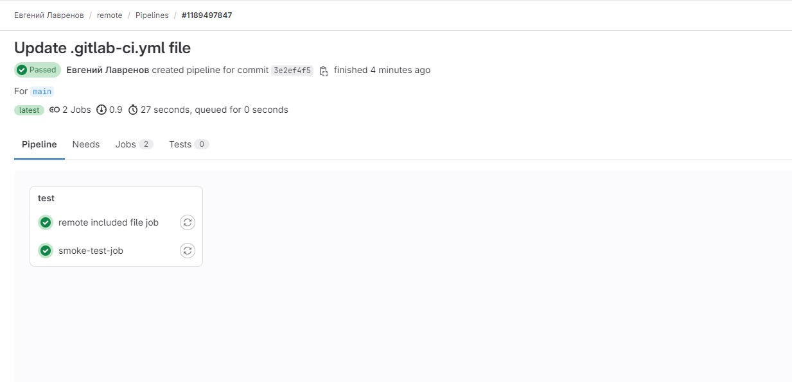

Сделать отдельный репозиторий с шаблонами CI и подключить его к своему основному репозиторию через include.

Решение

1. Создал локальный файл `local-test.gitlab-ci.yml`
2. Создан основной файл `.gitlab-ci.yml`

   include:
  - local: local-test.gitlab-ci.yml
  - remote: https://gitlab.com/ci-cd7655047/5/-/raw/main/remote-included-file.yml 

